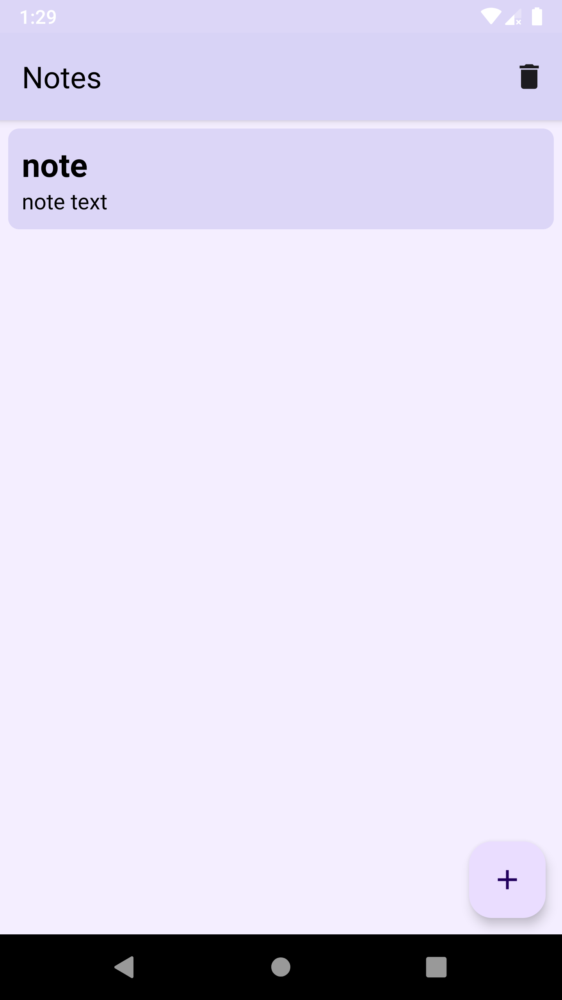
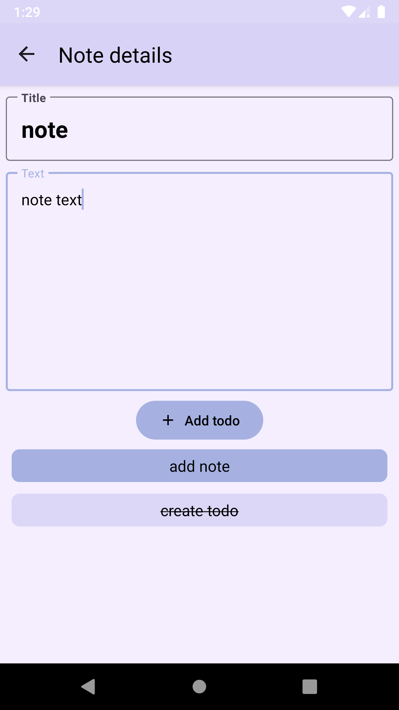
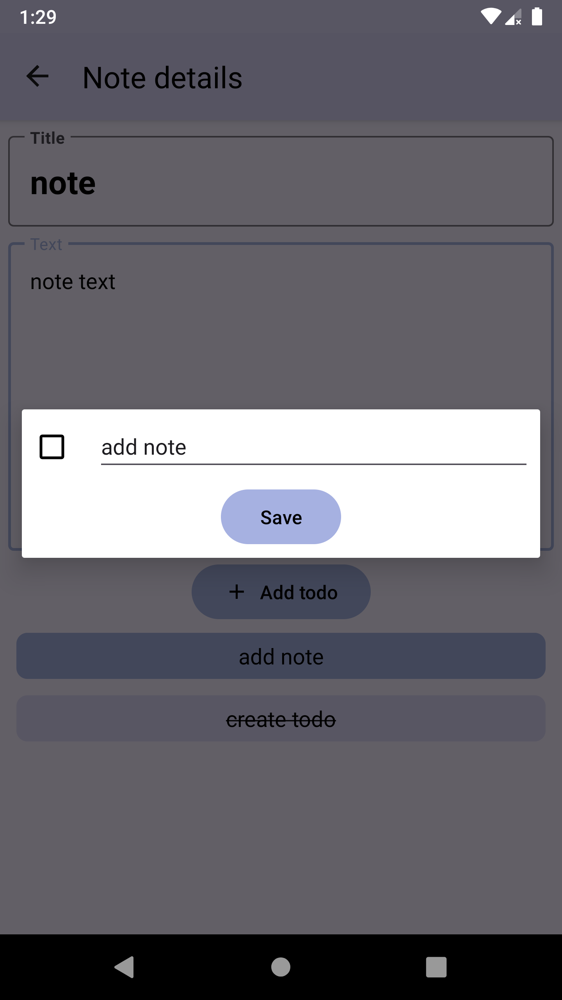

# FlexingNotes
FlexingNotes is an Android sample application created for learning purposes only.\
This application provides an ability to create notes and corresponding todos.

## Screenshots
### XML view system (Material 3 widgets)
<p float="left">
  
   
  
</p>


## Tech stack and concepts
* **[Java](https://www.java.com/)** as programming language.
* **[RxJava](https://github.com/ReactiveX/RxJava)** as framework for asynchronous jobs.
* Single activity support.
  * **[Fragments](https://developer.android.com/jetpack/androidx/releases/fragment)**.
  * **[Navigation components](https://developer.android.com/jetpack/androidx/releases/navigation)**.
* Modern XML UI toolkit.
  * **[Material components](https://material.io/develop/android)**
  * **ViewBinding** for binding .xml views to objects in Activities and Fragments
* **[Room](https://developer.android.com/jetpack/androidx/releases/room)** for local data layer.
* **[Lifecycle components](https://developer.android.com/jetpack/androidx/releases/lifecycle)**.
  * **ViewModel** for implementing MVVM pattern.
  * **Livedata** as dataholder for UI layer.  
* **[Dagger 2](https://dagger.dev/)** for dependency injection.

## Key features
#### i.e. what is unique among other samples?
* **Java** as programming language
* Dependent entity (**Todo** on **Note**) behaviour implementation
* **Material You** widgets
* Some widgets (**FloatingActionButton**, **Checkbox**) usage
* Dynamic layout based on user text inputs

## License
```
MIT License

Copyright (c) 2022 Shvyndia Andrii

Permission is hereby granted, free of charge, to any person obtaining a copy
of this software and associated documentation files (the "Software"), to deal
in the Software without restriction, including without limitation the rights
to use, copy, modify, merge, publish, distribute, sublicense, and/or sell
copies of the Software, and to permit persons to whom the Software is
furnished to do so, subject to the following conditions:

The above copyright notice and this permission notice shall be included in all
copies or substantial portions of the Software.

THE SOFTWARE IS PROVIDED "AS IS", WITHOUT WARRANTY OF ANY KIND, EXPRESS OR
IMPLIED, INCLUDING BUT NOT LIMITED TO THE WARRANTIES OF MERCHANTABILITY,
FITNESS FOR A PARTICULAR PURPOSE AND NONINFRINGEMENT. IN NO EVENT SHALL THE
AUTHORS OR COPYRIGHT HOLDERS BE LIABLE FOR ANY CLAIM, DAMAGES OR OTHER
LIABILITY, WHETHER IN AN ACTION OF CONTRACT, TORT OR OTHERWISE, ARISING FROM,
OUT OF OR IN CONNECTION WITH THE SOFTWARE OR THE USE OR OTHER DEALINGS IN THE
SOFTWARE.
```